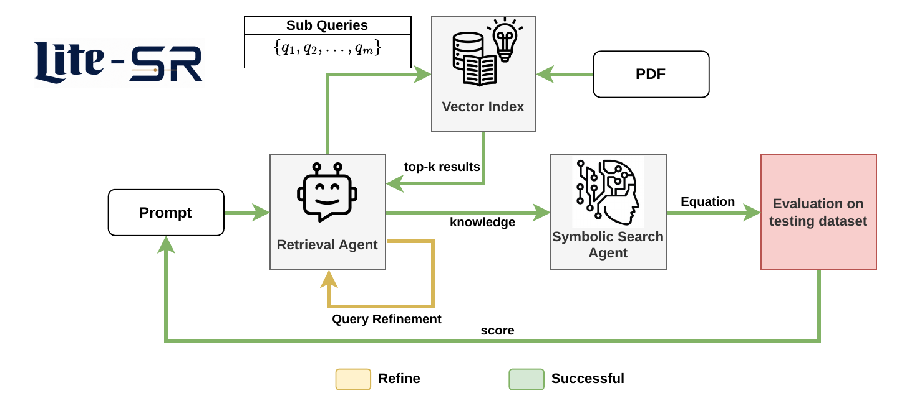

# LiteSR: Literature-Guided Agentic Retrieval for Symbolic Regression

> **ACM Conference on AI and Agentic Systems (CAIS) 2026**
> Workshop: AI Agents for Discovery in the Wild

LiteSR is a literature-guided agentic framework for scientific equation discovery. It couples a **Literature Agent** that retrieves and synthesizes mechanistic knowledge from scientific papers with a **Symbolic Solver Agent** that uses this knowledge to guide LLM-based symbolic regression.

---

## Architecture



LiteSR decomposes equation discovery into two coupled agents:

- **Literature Agent (AR):** Decomposes the target problem into sub-queries, retrieves relevant equations from a Milvus vector index of indexed PDFs, re-ranks results by relevance and variable alignment, iteratively refines weak queries, and synthesizes a structured mechanistic context `C`.
- **Symbolic Solver Agent (AG):** Uses `C` to condition an LLM (Claude) that iteratively proposes and refines equation-program hypotheses within an islands-based evolutionary experience buffer. Parameters are optimized with BFGS/Adam and evaluated by MSE against the observed data.

---

## Live Dashboard


The live dashboard at `http://localhost:3000` shows the evolutionary search in real time, including island scores, best equations per cluster, and convergence across epochs.

---

## Setup

### 1. Start infrastructure (Milvus vector DB + dashboard)

```bash
docker-compose up -d
```

This starts:
- **Milvus** (port `19530`): vector database for RAG
- **Dashboard** (port `3000`): live evolutionary search tracker
- **Attu** (port `8080`): Milvus GUI

### 2. Create the Python environment

```bash
conda env create -f environment.yml
conda activate litesr
```

### 3. Configure environment variables

```bash
cp .env.example .env
```

Edit `.env` and fill in your keys:

```
ANTHROPIC_API_KEY=your_anthropic_key   # required for RAG synthesis and equation generation
API_KEY=your_openai_key                 # optional, only if using OpenAI backend
HF_TOKEN=your_hf_token                  # optional, only if using HuggingFace backend
MILVUS_URI=http://localhost:19530
```

### 4. Add domain papers

Drop PDF papers relevant to your problem into the `papers/` directory. The Literature Agent will index them automatically on first run.

```
papers/
└── your_paper.pdf
```

The papers used for the built-in problems are listed in [`papers/REFERENCES.md`](papers/REFERENCES.md).

---

## Running

```bash
python main.py \
  --problem_name co2dissolution \
  --spec_path ./specs/specification_co2dissolution_numpy.txt \
  --log_path ./logs/co2dissolution
```

### Available problems

| `--problem_name` | `--spec_path` | Domain |
|---|---|---|
| `co2dissolution` | `./specs/specification_co2dissolution_numpy.txt` | CO2 carbonate chemistry |
| `no3dynamics` | `./specs/specification_no3dynamics_numpy.txt` | Soil nitrogen cycling |
| `rseos` | `./specs/specification_rseos_numpy.txt` | Extreme-pressure equation of state |

### LLM backend flags (set in `config.py`)

| Flag | Backend |
|---|---|
| `use_anthropic = True` | Claude via Anthropic API (default) |
| `use_ollama = True` | Local Ollama model |
| `use_openai_sdk = True` | OpenAI API |
| `use_hf_api = True` | HuggingFace Inference Router |

---

## Requirements

- Python 3.11 (via `environment.yml`)
- [Ollama](https://ollama.com) with `nomic-embed-text` pulled for local embeddings
- Docker for Milvus and the dashboard
- Anthropic API key for equation generation and RAG synthesis (no GPU required)

```bash
ollama pull nomic-embed-text
```

---

## Citation

If you use LiteSR in your work, please cite:

```bibtex
@article{litesr2026,
  title  = {LiteSR: Literature-Guided Agentic Retrieval for Symbolic Regression},
  year   = {2026},
}
```

---

## Acknowledgements

LiteSR builds on [LLM-SR](https://github.com/deep-symbolic-mathematics/LLM-SR) (Shojaee et al., ICLR 2025) and the [FunSearch](https://github.com/google-deepmind/funsearch) evolutionary framework (DeepMind). The solver agent core is adapted from their codebase under the Apache 2.0 license.
